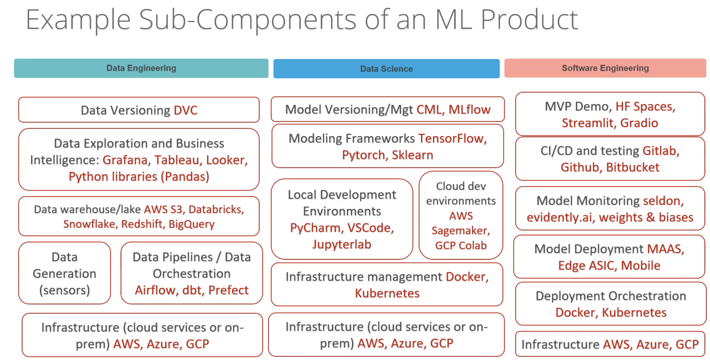
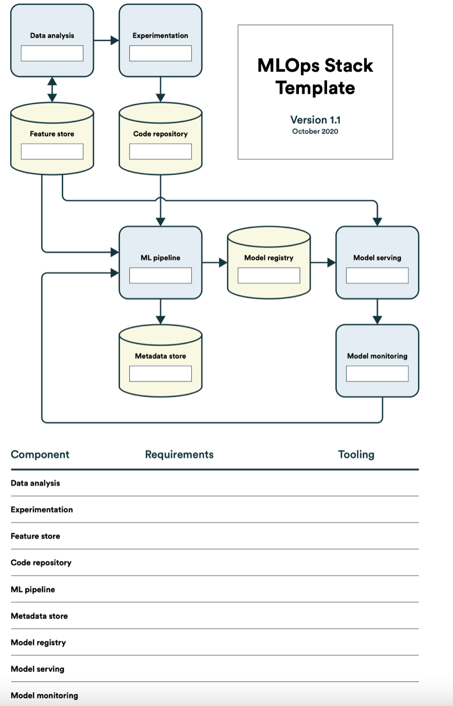

# Class notes

# Lecture 5: Tools and Infrastructure

MLOps
“The extension of the DevOps methodology to include Machine Learning and Data Science assets at first-class citizens within the DevOps ecology”.

Component

Roles:

Data Owners: Chief Information Officer, Chief Data Officer, IT System Owner, Product Manager.

Data Steward / Custodian: Data Engineer, Data Analyst, Data Scientist, Software Developer.

Collaboration
Nbdev - https://nbdev.fast.ai

DVC - https://dvc.org

DagsHub - https://dagshub.com

Other Solutions:
StreamLit: https://streamlit.io  (Frontend)

Gradio: https://gradio.app (Frontend)

Domino Data Lab: https://www.dominodatalab.com (ML Ops)

# Article Summaries:

## MLOps: Motivation by INNOQ:
https://ml-ops.org/content/motivation

There is predicted to be two major trends that will disrupt the economy/our lives
An exponential increase in available data, i.e. a data driven world.
A similar increase in the importance of artificial intelligence/machine 
learning/data science to extract insights from this data.
Machine learning is a powerful tool when correctly implemented/applied.
Examples of good applications:
Cases where there are a large amount of elements in the data.
Multi-parameter problems.

Deployment gap:
Companies are able to make machine learning models, but it is difficult to apply to deploy to production.
22 percent of companies that use ML have actually deployed anything successfully.
Issues with: scale, version control, model reproducibility, and aligning with stakeholders.
Deployment affects the data, ML model, and the code, i.e. changing anything, changes the whole deployment.
There are issues with data quality, decay of the model over time, and locality.
MLOps definition: the extension of the DevOps methodology to include Machine Learning and Data Science assets as first-class citizens within the DevOps ecology. Covers all aspects of machine learning deployment, and has evolved significantly over time as these issues have been realized.

## The Cost of Cloud, a Trillion Dollar Paradox by Sarah Wang and Martin Casado
https://a16z.com/2021/05/27/cost-of-cloud-paradox-market-cap-cloud-lifecycle-scale-growth-repatriation-optimization/

The cloud represents a significant shift in computing, growing significantly in capital and scale.
Over time a more complex lifecycle for the cloud has emerged.
While there are large cost benefits of updating older cloud systems, it is a massive project, so there is some hesitation.
Potential for total savings of over $500B from optimization.
Estimates show that the cost of updating is less than half of current maintenance for these systems.
Rough estimates of cloud spending:

Immense possible savings and market capitalization from these savings.
Consistent updates prevent companies eventually getting locked into these systems
Considerations that may help:
Cloud costs as a key performance indicator
Incentivizing the right behaviors
Optimization always
Plan for repatriation
Incrementally repatriate
Huge opportunity in optimizing code/updating cloud hardware.

## Emerging Architectures for Modern Data Infrastructure by Matt Bornstein, Martin Casado, and Jennifer Li
https://future.a16z.com/emerging-architectures-modern-data-infrastructure/

Updated diagram of data infrastructure.

Machine learning infrastructure.

Stability is still the most important factor for data infrastructure.
Two main classes:
Analytic systems: Making decisions based on data
Operational :systems: Data powered products
Cambrian explosion:
Significant increase in support tools and applications
Modern business intelligence:
Metrics layer, that gives definitions directly in the hardware
SQL still the core
Dashboards most common application
Growth in new applications
Data discovery companies expanding 
Multimodal data processing:
Core systems still growing significantly
Lakehouse architecture: robust storage, paired with powerful processing engines
Storage getting improved
Stream processing potentially growing
AI and ML:
Building/operating a large ML stack is complicated
Current ML industry focused on data side more than ML side
Pre-trained models more common/default
Monitoring tools expanding
Pre-build APIs growth
Data platform:
Data consolidating to smaller group of companies
More standard data submissions
Increase in making the data more available/easy to use for developers
Data apps:
Surge in new data infrastructure products
Easier to adopt new data applications

## Databricks Blog Post About Snowflake, Mostafa Mokhtar, et. al.
https://databricks.com/blog/2021/11/15/snowflake-claims-similar-price-performance-to-databricks-but-not-so-fast.html

Databricks just set the world record for speed in a data warehouse
Snowflake is another company, disputes the record
Benchmarking/testing still showed that databricks is ahead
Easy to perform better on non-official benchmarks as you can optimize for the test
Open official benchmarking is the best test
Simplicity is the best strategy
Open data formats
Single copy analytics
Pulling back from SQL only
Data lakehouse covers the open source ecosystem for data
Meant to be easy to work with
Native support for ML/data science/streaming
External benchmarks are again the most representative of a product

## State of MLOps by INNOQ
https://ml-ops.org/content/state-of-mlops

MLOps Infrastructure Stack
Well defined structures, processes, and tools are required to correctly implement ML models
Any model needs a large amount of experimentation/testing/edits before put into production
MLOps needs tools for:
data engineering,
version control of data, ML models and code,
continuous integration and continuous delivery pipelines,
automating deployments and experiments,
model performance assessment, and
model monitoring in production.
Multiple cloud providers are working on tools for ML implementations
Currently there is a lot of change in MLOps technologies
Models/applications can vary significantly with regulation, difficulty, and application case
Template for MLOps stack:

Systems can be customized by implementing their own systems or combinations of open source
Constantly changing landscape of available technologies
List of the production machine learning tools:

